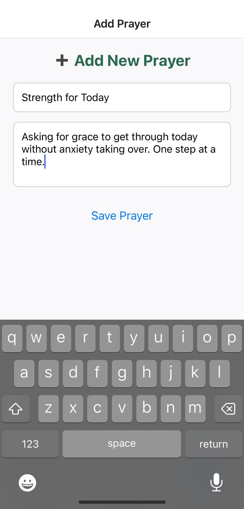

# 🙏 Prayer Journal App

A cross-platform **Prayer Journal App** built with **React Native** and **TypeScript**.  
The app allows users to **record prayer requests**, **track progress**, and **reflect on answered prayers**.  
Data is stored locally on the device using **AsyncStorage**, with a scalable architecture that can be extended to cloud backends such as Supabase or Firebase.

---

## 📖 Table of Contents
- [Features](#features)
- [Technologies](#technologies)
- [Requirements](#requirements)
- [Installation](#installation)
- [Usage](#usage)
- [Screenshots](#screenshots)
- [Future Improvements](#future-improvements)
- [Contribution](#contribution)
- [License](#license)

---

## ✨ Features
- Add new prayer requests with title & description  
- View a list of active (unanswered) prayers  
- Mark prayers as answered (moves to “Answered” tab)  
- Persistent local storage with **AsyncStorage**  
- Modular, typed components using **TypeScript**  

---

## 🛠️ Technologies
- [React Native](https://reactnative.dev/)  
- [TypeScript](https://www.typescriptlang.org/)  
- [React Navigation](https://reactnavigation.org/)  
- [AsyncStorage](https://github.com/react-native-async-storage/async-storage)  

---

## 📦 Requirements
- Node.js (v18 or later recommended)  
- npm or yarn package manager  
- Expo CLI (`npm install -g expo-cli`)  

---

## ⚙️ Installation

```bash
# Clone the repository
git clone https://github.com/your-username/prayer-journal-app.git

# Navigate to the project folder
cd prayer-journal-app

# Install dependencies
npm install
# or
yarn install
```
---

## ▶️ Usage

Start the app with expo

```bash
npx expo start
```
---
## 📷 Screenshots





---
## 🚀 Future Improvements
- Cloud sync with Supabase (Postgres) or Firebase Firestore
- Prayer categories (Personal, Family, Church)
- Notifications & reminders
- Authentication for multiple users
